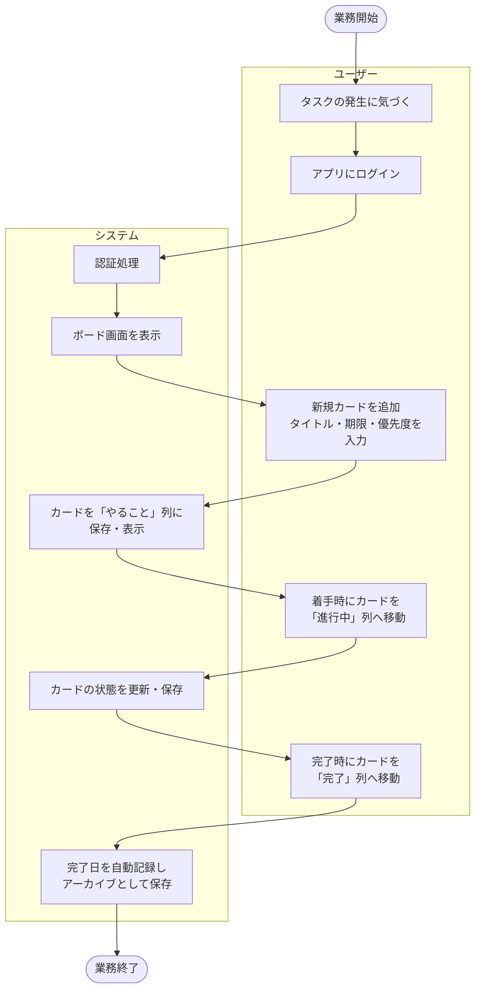
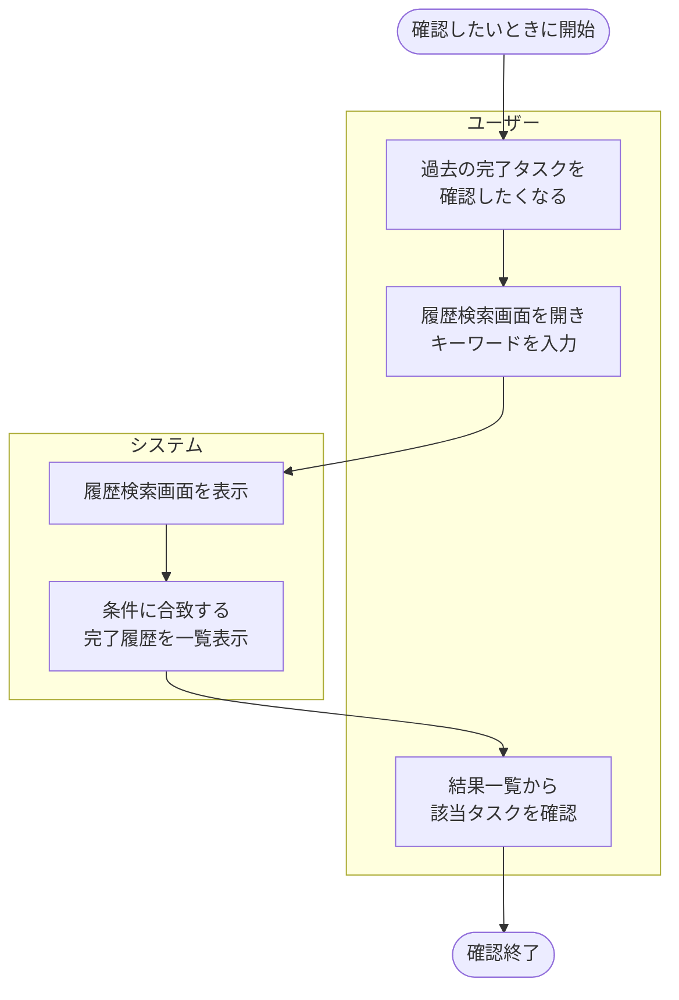

# 業務フロー図（詳細）

[← 要件定義書に戻る](../requirements.md)

対象範囲：フェーズ4までの個人利用シーン（ログイン〜タスク完了〜履歴振り返り）。

## メイン業務サイクル

タスクの発生から完了までの基本的な業務の流れ。

## 任意の付随作業（履歴確認）

メイン業務サイクルの終了後、必要に応じて実施する任意の作業。
過去に完了したタスクの事実を後から思い出す／確認するために行う。

## 補足

- フェーズ1〜2では「ログイン」を伴わず、ブラウザ上で直接ボード画面に到達する
- フェーズ5（将来）では、上記フローに加えて「グループメンバーへ共有」「他メンバーが編集」というステップが追加される
