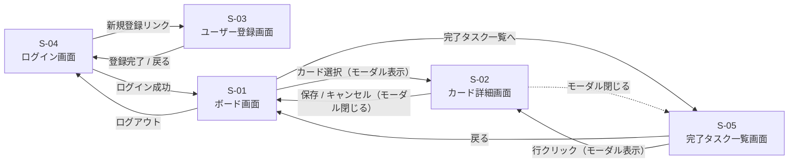

# 画面遷移図（詳細）

[← 要件定義書に戻る](../requirements.md)

## フェーズ1〜4（個人利用）

ログイン画面を起点とし、認証後にボード画面を中心としたタスク管理画面群へ遷移する。

**補足：**
- フェーズ1〜2は認証機能がないため、起点はボード画面（S-01）となり、S-03/S-04 は存在しない
- フェーズ3でログイン・ユーザー登録・ログアウトの遷移が追加される
- フェーズ4で履歴検索画面（S-05）への遷移が追加される

## フェーズ5（将来：グループ機能）

フェーズ5の画面遷移図は別ファイル [`../requirements_phase5.md`](../requirements_phase5.md) を参照。
