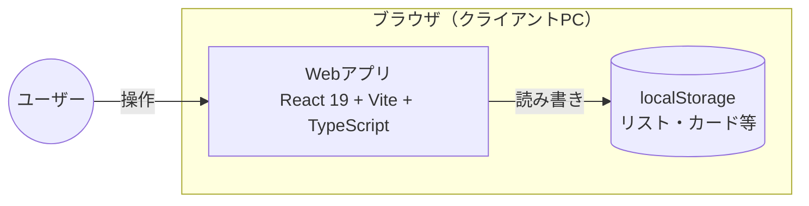
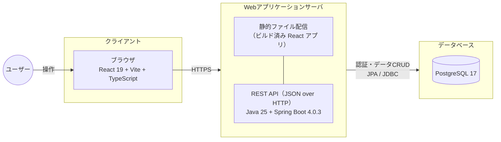

# システム構成図（詳細）

[← 要件定義書に戻る](../requirements.md)

## フェーズ1〜2（ブラウザ単独構成）

フェーズ3以降と同じフロントエンドスタック（React + Vite + TypeScript）で構築するが、バックエンド／データベースは持たず、データはブラウザの localStorage に保存される。サーバや外部通信は発生しない。

**補足：**
- データはブラウザごと・端末ごとに保存されるため、別端末への持ち出しはできない
- 認証は持たず、ブラウザを開けば即座にボード画面に到達する
- 開発時は `npm run dev`、配信が必要なら `npm run build` の成果物を GitHub Pages 等に配置できる
- フェーズ3への移行は、データアクセス層を localStorage 呼び出しから Axios 経由のバックエンドAPI 呼び出しに差し替えるだけで済む
- `prototype/` 配下の HTML/CSS/JavaScript は要件確認用の使い捨てプロト（本実装はこの構成で新規構築）

## フェーズ3以降（Web3層構成）

フロントエンド／バックエンド／データベースの3層構成に移行する。ユーザー認証とサーバー側データ保存により、複数端末からのアクセスが可能になる。

**補足：**
- 認証は Spring Security + JWT、パスワードは BCrypt でハッシュ化
- DB マイグレーションは Flyway、ローカル DB 起動は Docker / docker-compose を使用
- フェーズ5でグループ機能を導入する際もこの3層構成は変わらず、データベース内のテーブル構成のみ変更される（[`../requirements_phase5.md`](../requirements_phase5.md) のフェーズ5 ER図 参照）
- 将来的に通知機能や提案フローを追加する際は、メール送信サービスや非同期ジョブ基盤などの外部要素が加わる可能性がある
- ホスティング先（クラウドサービス）はスクール指定がないため未定（候補：Render／Railway／AWS）
