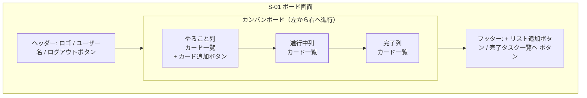
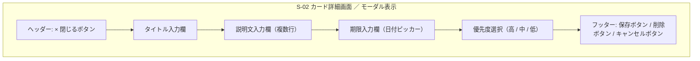
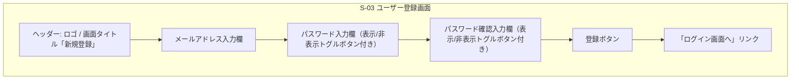
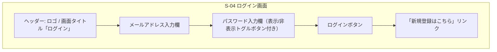
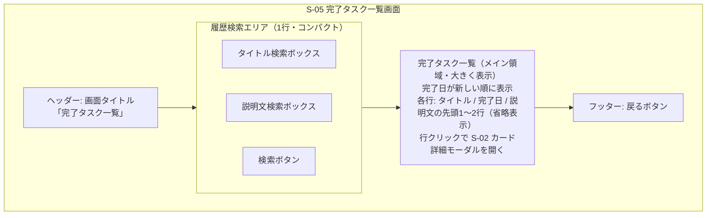

# 画面ワイヤーフレーム（詳細）

[← 要件定義書に戻る](../requirements.md)

各画面の要素配置（ブロック構造）を Mermaid で示す。実際のレイアウト（余白・サイズ・色）は別途デザインで決定する。

## S-01 ボード画面

## S-02 カード詳細画面（モーダル）

ボード画面のカードをクリックすると、ボード画面の上に重ねてモーダル表示される。背景はオーバーレイで暗くする想定。

## S-03 ユーザー登録画面

## S-04 ログイン画面

## S-05 完了タスク一覧画面

画面を開いた時点では、完了したタスクを **完了日が新しい順（最新順）** で一覧表示する。
画面上部に1行分の履歴検索エリアを配置し、キーワードを入力すると一覧が検索結果に絞り込まれる。
画面の大部分は完了タスク一覧の表示領域として使い、戻るボタンはフッターに配置する。

各タスクは **タイトル・完了日・説明文（先頭1〜2行のみ省略表示）** を一覧に表示する。
直感的に完了タスクの内容が把握できることを目的とし、行をクリックすると S-02 カード詳細画面（モーダル）が開いて説明文の全文を確認できる。

