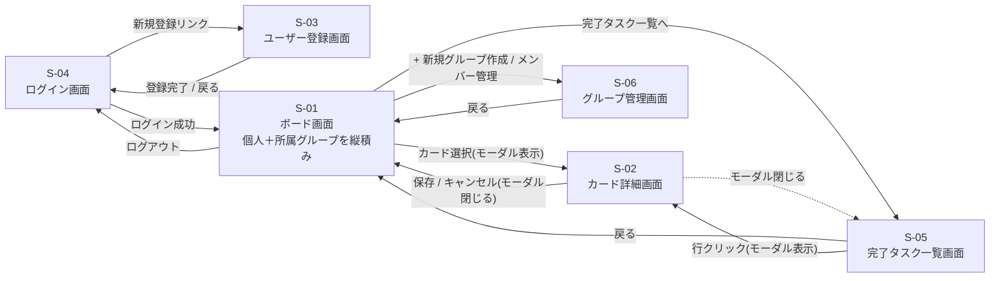
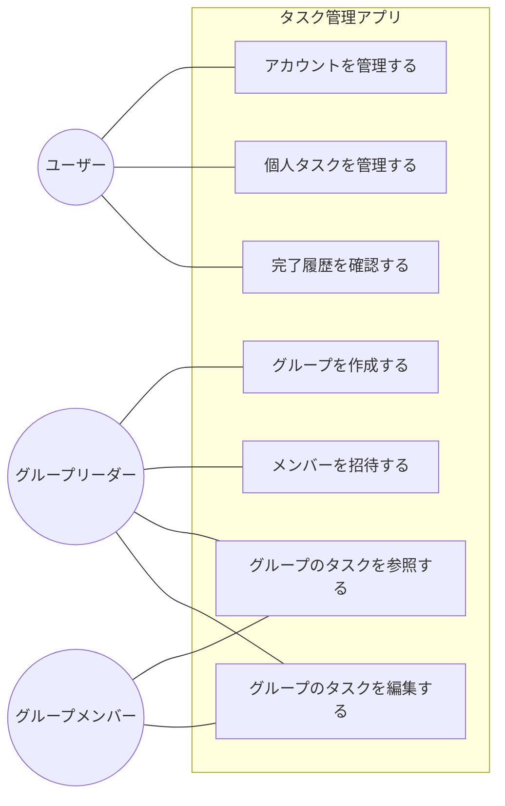
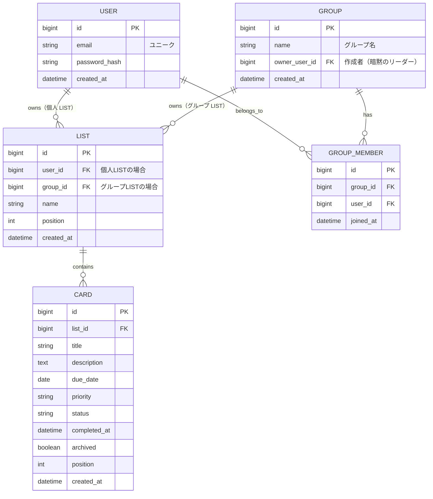

# タスク管理アプリ 要件定義書（フェーズ5：将来拡張）

[← 本書（フェーズ1〜4）に戻る](requirements.md)

本ファイルは、フェーズ5（グループ機能）の要件をフェーズ1〜4とは別に整理した将来拡張用の資料である。本書（`requirements.md`）の正式スコープはフェーズ1〜4までとし、本ファイルは参考情報として位置づける。

## 目次

1. [概要](#1-概要)
2. [画面構成（縦積み共存ビュー）](#2-画面構成縦積み共存ビュー)
3. [機能要件](#3-機能要件)
4. [将来検討事項](#4-将来検討事項)
5. [画面構成・遷移図](#5-画面構成遷移図)
6. [ユースケース図・記述](#6-ユースケース図記述)
7. [各機能のIPO](#7-各機能のipo)
8. [入力チェック仕様](#8-入力チェック仕様)
9. [エラーメッセージ一覧（フェーズ5特有）](#9-エラーメッセージ一覧フェーズ5特有)
10. [データ仕様（データ項目・ER図）](#10-データ仕様データ項目er図)

---

## 1. 概要

フェーズ5では「グループ」機能を導入し、**1つのボード画面（S-01）の中に個人タスクとグループタスクを縦積みで共存**させる。
ユーザーがログインしてボード画面を開くと、「個人」セクションの下に、自分が所属する各グループのセクションが順に並び、すべて1画面で見渡せる。

### 1.1 想定ユーザー

- 個人タスクと、所属するチームの共有タスクを **同じ画面で** 一覧したいユーザー
- 簡易的なチーム共有を必要とする小規模チーム

### 1.2 設計方針

- LIST は **「個人所有」または「グループ所有」** のいずれか（排他）
  - 個人 LIST：`user_id` を持つ
  - グループ LIST：`group_id` を持つ
- ボード画面（S-01）は、ログインユーザーの個人 LIST と所属グループの LIST を取得し、**セクション単位で縦積み描画**
- ボードという独立エンティティは導入しない（既存の `requirements.md` 9.1 LIST にカラムを追加するだけ）
- フェーズ4 → フェーズ5 の移行は LIST に `group_id` を追加する軽微な変更で済む

---

## 2. 画面構成（縦積み共存ビュー）

ボード画面（S-01）のレイアウトイメージ：

```
┌────────────────────────────────────────────────┐
│ ヘッダー：ロゴ／ユーザー名／ログアウト                │
├────────────────────────────────────────────────┤
│ ■ 個人                                           │
│   [やること]  [進行中]  [完了]                     │
│   ┌──────┐  ┌──────┐  ┌──────┐               │
│   │カード│  │カード│  │カード│                  │
│   └──────┘  └──────┘  └──────┘               │
├────────────────────────────────────────────────┤
│ ■ グループ「営業チーム」 [メンバー管理]            │
│   [やること]  [進行中]  [完了]                     │
│   …                                              │
├────────────────────────────────────────────────┤
│ ■ グループ「開発チーム」 [メンバー管理]            │
│   [やること]  [進行中]  [完了]                     │
│   …                                              │
├────────────────────────────────────────────────┤
│ フッター：+ リスト追加（個人）／ + 新規グループ作成 │
│         ／ 完了タスク一覧へ                        │
└────────────────────────────────────────────────┘
```

- 各セクションは独立したカンバン（やること／進行中／完了）を持つ
- グループセクションのヘッダー右側に「メンバー管理」ボタン → グループ管理画面（S-06）へ遷移
- リーダーが所有するグループのみメンバー管理ボタンが活性（非リーダーは閲覧のみ）
- カードのドラッグ&ドロップは **同一セクション内に限定**（個人 ⇄ グループ間の移動は不可）

---

## 3. 機能要件

| ID | 機能名 | 概要 |
|----|--------|------|
| F-19 | グループ作成 | 複数ユーザーでタスクを共有するグループを作成する |
| F-20 | メンバー招待 | グループに既存ユーザーを招待する |
| F-21 | グループタスク共有 | グループに紐付くリスト・カードを作成・参照・編集できる |

※ フェーズ4までの F-19「ボード作成」は、本設計（縦積み共存）では不要となるため廃止。番号を 1 つずつ繰り上げる。

---

## 4. 将来検討事項

下記はフェーズ5の基本機能の上に積み上げることを想定した検討事項であり、本要件定義の正式スコープには含めない。

| 項目 | 概要 |
|------|------|
| 担当者割当・進捗の可視化 | カードに担当者（assignee）を設定し、誰がどのタスクを受け持っているか・完了しているかを一覧で確認できるようにする |
| リーダー権限・認可ロジック | グループにリーダー（owner）役割を設け、追加・削除・編集・催促などの管理操作はリーダーのみ可能にする。タスク移動は担当者またはリーダーのみ可能とする |
| タスク提案フロー | リーダー以外のメンバーがタスクを提案でき、リーダーが承認するとタスク化される。提案には提案者情報を含める |
| 通知機能 | 提案・催促・割当などのイベントをユーザーに通知する仕組み |
| 個人 ⇄ グループ間カード移動 | カードを個人とグループの間で移動できるようにする（現スコープでは不可） |

---

## 5. 画面構成・遷移図

### 5.1 画面一覧（フェーズ5で追加）

| 画面ID | 画面名 | 概要 |
|--------|--------|------|
| S-06 | グループ管理画面 | グループの作成、メンバー招待、所属グループ一覧 |

ボード画面（S-01）にグループセクションが縦積みで追加される変更も加わる。

### 5.2 画面遷移図

ボード画面に **グループのメンバー管理ボタン** が追加され、S-06 に遷移する。フッターには「+ 新規グループ作成」ボタンが追加され、S-06 のグループ作成フローを起動する。



---

## 6. ユースケース図・記述

### 6.1 ユースケース図

フェーズ5では「グループメンバー」「グループリーダー」がアクターとして加わる。グループリーダーはグループメンバーを兼ねる関係（Leader is-a Member）。



**補足：**
- ユーザー（U）はログイン直後の基本アクター。グループに参加すると「グループメンバー（M）」として、グループを作成すると「グループリーダー（L）」として振る舞う
- グループの作成・メンバー招待はリーダーのみが実行できる
- グループタスクの参照・編集はメンバー／リーダーいずれも実行できる（編集権限の細分化は将来検討事項）

### 6.2 ユースケース記述

#### UC-06 グループを作成する

| 項目 | 内容 |
|------|------|
| アクター | グループリーダー（作成時点でリーダーになるユーザー） |
| 概要 | 複数ユーザーで共有するためのグループを作成する |
| 事前条件 | ログイン済み |
| 事後条件 | 新しいグループが作成され、作成者がリーダーかつメンバーとして登録されている。ボード画面に当該グループのセクションが追加される |

**基本フロー**
1. ボード画面のフッター「+ 新規グループ作成」を押す（または S-06 で「新規グループ作成」を押す）
2. グループ名を入力する
3. システムがグループを作成し、作成者を `owner_user_id` として登録、自動的にメンバーにも登録する
4. ボード画面に戻ると、新しいグループのセクションが縦積みで追加されている

**代替フロー**
- A1. グループ名未入力：必須エラー（E-015）
- A2. グループ名 50 文字超過：エラー（E-016）

---

#### UC-07 メンバーを招待する

| 項目 | 内容 |
|------|------|
| アクター | グループリーダー |
| 概要 | 既存ユーザーをグループメンバーとして招待する |
| 事前条件 | リーダーがそのグループを所有している |
| 事後条件 | 招待されたユーザーがグループメンバーとして登録されている |

**基本フロー**
1. リーダーがボード画面で当該グループの「メンバー管理」ボタン → S-06 へ
2. 「メンバーを招待」ボタンを押し、メールアドレスを入力
3. システムが該当ユーザーを検索し、`GROUP_MEMBER` に追加
4. 次回その招待ユーザーがログインすると、ボード画面にグループセクションが現れる

**代替フロー**
- A1. ユーザーが存在しない：E-104
- A2. すでにメンバー：E-105（警告）
- A3. リーダー以外が実行：E-107（権限エラー）

---

#### UC-08 グループのタスクを参照する

| 項目 | 内容 |
|------|------|
| アクター | グループメンバー、グループリーダー |
| 概要 | 自分が所属するグループのタスクを、ボード画面のグループセクションで閲覧する |
| 事前条件 | グループに所属している |
| 事後条件 | ボード画面のグループセクションにカード一覧が表示される |

**基本フロー**
1. ログイン後、ボード画面が自動的に個人セクションと所属グループセクションを縦積みで表示する
2. 各カードをクリックすると、詳細モーダル（S-02）が開いて内容を確認できる

**代替フロー**
- A1. グループから外された後にアクセス：当該グループセクションは表示されない（または再描画時に E-106）

---

#### UC-09 グループのタスクを編集する

| 項目 | 内容 |
|------|------|
| アクター | グループメンバー、グループリーダー |
| 概要 | グループセクション内のカードを追加・移動・編集・削除する |
| 事前条件 | 自分が所属するグループのセクションを開いている |
| 事後条件 | 該当グループのカード状態が更新されている |

**基本フロー**
1. メンバーがグループセクション内で UC-02（タスク登録）／UC-03（進捗更新）と同様の操作を行う
2. システムは変更を該当グループの LIST/CARD に保存
3. 同じグループの他メンバーが次回参照したときに、変更が反映された状態で表示される

**代替フロー**
- A1. 編集権限の細分化（リーダーのみ編集可など）は将来検討事項であり、現スコープでは全メンバーに編集を許可する
- A2. 同時編集による競合：最終保存が優先される（楽観的ロック方式は将来検討事項）
- A3. 個人 LIST とグループ LIST の間でカードを D&D：移動不可（D&D 操作は受け付けない）

---

## 7. 各機能のIPO

| ID | 機能名 | 入力 | 処理 | 出力 | 関連UC |
|----|--------|------|------|------|--------|
| F-19 | グループ作成 | グループ名 | 入力検証 → グループを作成、作成者をリーダーかつメンバーとして登録 | ボード画面に新しいグループセクションが追加 | UC-06 |
| F-20 | メンバー招待 | 招待対象のメールアドレス | ユーザー検索 → GROUP_MEMBER に追加 | グループにメンバーが追加される | UC-07 |
| F-21 | グループタスク共有 | グループ LIST/CARD に対する追加・移動・編集・削除操作 | グループ単位で保存し、所属メンバー全員に同期表示 | グループセクション上のタスク変更 | UC-08, UC-09 |

---

## 8. 入力チェック仕様

### S-06 グループ管理画面

| 項目 | 必須 | 形式・制約 | エラーメッセージ |
|------|------|----------|-----------------|
| グループ名 | ○ | 1〜50文字 | E-015「グループ名を入力してください」／ E-016「グループ名は50文字以内で入力してください」 |
| 招待メールアドレス | ○ | メール形式、登録済みユーザーであること | E-005／E-006／E-104「該当するユーザーが見つかりません」／E-105「このユーザーは既にメンバーです」 |

---

## 9. エラーメッセージ一覧（フェーズ5特有）

### 9.1 入力チェック系（S-06）

| コード | メッセージ | 対象画面 | 発生条件 | 重要度 |
|-------|-----------|---------|---------|-------|
| E-015 | グループ名を入力してください | S-06 | グループ作成で未入力 | E |
| E-016 | グループ名は50文字以内で入力してください | S-06 | グループ名が50文字超過 | E |

### 9.2 認証・業務系

| コード | メッセージ | 対象画面 | 発生条件 | 重要度 |
|-------|-----------|---------|---------|-------|
| E-104 | 該当するユーザーが見つかりません | S-06 | 招待時に対象ユーザーが未登録 | E |
| E-105 | このユーザーは既にメンバーです | S-06 | 招待時に既にメンバー | W |
| E-106 | このグループへのアクセス権がありません | S-01 グループセクション | グループから外された後にアクセス | E |
| E-107 | この操作を行う権限がありません | S-01, S-06 | リーダー専用操作を非リーダーが実行 | E |

メール／パスワード関連（E-005, E-006）はフェーズ3で定義済みのため再掲しない。
旧 E-017〜E-019（ボード関連）は本設計では不要のため廃止。

---

## 10. データ仕様（データ項目・ER図）

### 10.1 既存エンティティの変更点

#### LIST

`group_id`（グループ所有 LIST の場合に設定）を追加する。`user_id` と `group_id` は **どちらか一方のみ** 値を持つ（排他）。

| 項目 | 型 | 必須 | 備考 |
|------|----|----|------|
| ID | 文字列 | ○ | 一意の識別子 |
| ユーザーID | 数値 | △ | 個人 LIST の場合に設定 |
| グループID | 数値 | △ | グループ LIST の場合に設定（フェーズ5で追加） |
| 列名 | 文字列 | ○ | やること／進行中／完了／カスタム |
| 並び順 | 数値 | ○ | 同一所有内での表示順 |

### 10.2 フェーズ5で追加するエンティティ

#### グループ（GROUP）

| 項目 | 型 | 必須 | 備考 |
|------|----|----|------|
| ID | 数値 | ○ | 一意の識別子 |
| グループ名 | 文字列 | ○ | 表示名 |
| 作成者ユーザーID | 数値 | ○ | 作成者（暗黙のリーダー） |
| 作成日時 | 日時 | ○ | |

#### グループメンバー（GROUP_MEMBER）

ユーザーとグループの所属関係（多対多）を表す中間テーブル。

| 項目 | 型 | 必須 | 備考 |
|------|----|----|------|
| ID | 数値 | ○ | 一意の識別子 |
| グループID | 数値 | ○ | 所属先のグループ |
| ユーザーID | 数値 | ○ | 所属するユーザー |
| 参加日時 | 日時 | ○ | |

### 10.3 ER図（フェーズ5）



**補足：**
- LIST.user_id と LIST.group_id はどちらか一方のみ値を持つ（排他制約。アプリ層もしくは DB のチェック制約で担保）
- フェーズ4 → フェーズ5 の移行は LIST に `group_id` カラムを追加するだけで済む（既存個人 LIST はすべて `user_id` 既存のままで動作）
- 担当者割当・リーダー権限・提案フロー・通知などは将来検討事項であり、本ER図には含めていない
